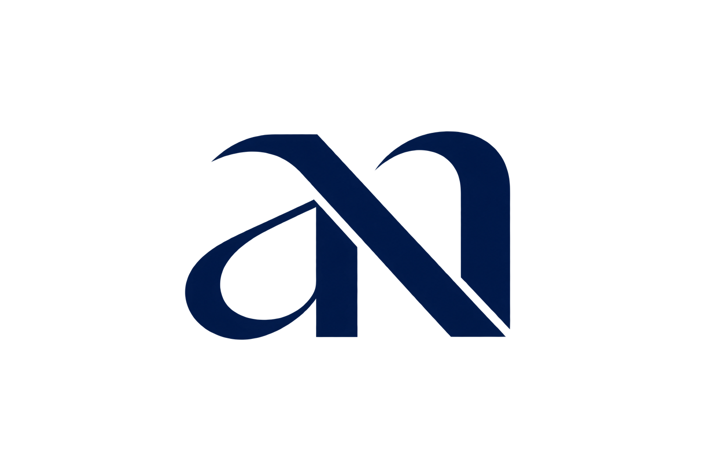

<div align="center">



# Aditya Nurdiansyah — Portofolio
### Software Engineer • Precision, Clean Architecture & Quiet Luxury

<p>
  <em>good software is defined by precision — clean architecture, reliable systems, and thoughtful interfaces.</em>
</p>

<p>
  <a href="https://github.com/adttnewbie/adtt-portofolio"></a>
  <a href="https://github.com/adttnewbie/adtt-portofolio"></a>
  
  
  
  
  
</p>

<p>
  <a href="#-quick-start"><strong>Quick Start</strong></a> •
  <a href="#-fitur-utama">Fitur</a> •
  <a href="#-tech-stack">Tech Stack</a> •
  <a href="#-struktur">Struktur</a> •
  <a href="#-deploy">Deploy</a>
</p>

</div>

---

## ✨ Tentang

> *i'm aditya, a software engineer who believes good software is defined by precision. clean architecture, reliable systems, and thoughtful interfaces shape the way i work, because every decision should have a reason and every detail should earn its place.*
>
> *i build digital products that are fast, accessible, maintainable, and quietly refined.*

Portofolio editorial — **maximal, busy, luxury** tapi tetap presisi. Dibuat untuk UMKM yang ingin tampil besar: mono **INDIGO #5855F6**, mesh + noise hero, tilt + spotlight bento, marquee, orbit, dan scroll-progress. Bukan sekadar portofolio, ini **brand system**.

| Bagian | Highlights |
|---|---|
| **Hero** | Mesh gradient indigo, magnetic CTAs, 190px spotlight cursor, depth text `ADITYA` |
| **About** | Lanyard 3D (Rapier + Drei), bento + orbit, vertical typography |
| **Skills** | Bento tilt + spotlight, LogoLoop & Marquee |
| **Projects** | Circular Gallery (OGL/WebGL) — bend + infinite, tanpa scroll-hijack |
| **Contact** | Orbit 8 bubble 76px / R 188, warna asli platform, smooth `playbackRate` pause on item hover |

---

## 🎯 Fitur Utama

- **Tanpa scroll-jacking** — vertical wheel tetap scroll halaman; gallery hanya merespon `drag` / `swipe horizontal` / `Shift+scroll` / arrow keys
- **Orbit smooth** — `WAAPI playbackRate` lerp `0.06` (~600ms) hanya saat hover **item bubble**, bukan area kosong
- **Warna asli platform** — WhatsApp #25D366, Facebook #1877F2, Telegram #26A5E4, LinkedIn #0A66C2, Instagram #E4405F, Mail #EA4335, GitHub/TikTok adaptif dark ↔ light
- **Theme indigo mono** — `var(--surface)` / `var(--border)` sinkron body gradient, py-10/14 tanpa `minHeight` paksa
- **Performa** — Vite 8 + OGL + Three, `dpr` capped 2, image `sat -100` biar struktur kebaca, 42s linear orbit + `prefers-reduced-motion`

---

## 🧰 Tech Stack

| Layer | Tools |
|---|---|
| **Core** | React 19, TypeScript ~6, Vite 8 |
| **Styling** | Tailwind CSS 4 (`@tailwindcss/vite`), CSS variables (`--fg`, `--bg`, `--surface`) |
| **3D / Motion** | Three 0.185, `@react-three/fiber` 9, `@react-three/drei` 10, `@react-three/rapier` 2, OGL 1, GSAP 3, meshline |
| **Icons** | react-icons (Fa, Fi, Bs) |
| **Quality** | oxlint, tsc -b, `vite preview` + Puppeteer shot scripts |

---

## 🚀 Quick Start

```bash
# 1. clone
git clone https://github.com/adttnewbie/adtt-portofolio.git
cd adtt-portofolio

# 2. install (node >= 20)
npm install

# 3. dev
npm run dev        # http://localhost:5173

# 4. build & preview
npm run build
npm run preview    # http://localhost:4173

# 5. lint
npm run lint
```

> **Node** 20+ direkomendasikan. Jika pakai `pnpm`/`yarn`, hapus `package-lock.json` dulu atau pakai `--force`.

---

## 📁 Struktur

```
.
├── public/
│   ├── adtt.png / adtt.webp        # foto hero & lanyard
│   ├── lanyard-biodata-front.png    # depan kartu lanyard
│   └── logo.png
├── src/
│   ├── App.tsx                     # layout + scroll progress + reveal
│   ├── index.css                   # design tokens (indigo mono)
│   ├── main.tsx
│   ├── assets/lanyard/card.glb     # model 3D kartu
│   ├── components/
│   │   ├── Lanyard.tsx             # 3D physics lanyard
│   │   ├── layout/Header.tsx + Footer.tsx
│   │   ├── sections/Hero.tsx / About.tsx / Skills.tsx / Projects.tsx / Contact.tsx
│   │   └── ui/CircularGallery.tsx / Orbit.tsx / Marquee.tsx / LogoLoop.tsx / ...
│   ├── data/site.ts / projects.ts / skills.ts
│   └── hooks/useTheme.tsx / useMagnet.ts / useTilt.ts
├── index.html
├── vite.config.ts                  # tailwind + react + glb
└── tsconfig.*.json
```

---

## 🎨 Design Tokens

```css
/* indigo mono opulence */
--color-primary: #5855F6;
--fg:   light #111 / dark #fff
--fg-muted: rgba(… , 0.6)
--surface:  var(--bg) subtle
--border:   rgba(88,85,246,0.12)
```

- Layout unified: `max-w-[1360px] px-4 md:px-6` untuk hero + semua section (tanpa double padding)
- Body bg: hero periwinkle gradient `light #fff → #eef2ff → #e0e7ff` / `dark #0a0a0b → #111827 → #1e1b4b` — sections transparan

---

## 🖼️ Sections

### Hero
Magnetic CTA, tilt card, spotlight reveal (B&W base + color overlay 190px radius ngikutin cursor), background `ABOUT` faint text.

### About
Grid 12 col — Lanyard 3D kiri, copy kanan + vertical `ADITYA` (`writing-mode: vertical-rl`, `rgba(88,85,246,0.09)`). Copy terbaru presisi, tanpa buzzword UMKM.

### Projects
`CircularGallery` (OGL) — `bend={1}`, `scrollSpeed={3}`, `scrollEase={0.05}`, buffer `concat(gallery)` buat infinite. Fix: cek `|deltaX| > |deltaY|` atau `Shift+wheel` baru hijack, selain itu return biar page scroll.

### Contact — Orbit
`SIZE 76, RADIUS 188`, circle sempurna `1/1 + borderRadius 50%`, `42s linear infinite` + `counter 42s` di node biar icon tetap upright. Hover item → `playbackRate 1 ↔ 0` lerp, `hoveredCount` biar pindah bubble tetap pause.

---

## ⚙️ Scripts

| Script | Deskripsi |
|---|---|
| `npm run dev` | Vite dev + HMR |
| `npm run build` | `tsc -b && vite build` (cek `dist/`) |
| `npm run preview` | Serve `dist` di :4173 |
| `npm run lint` | oxlint |

Shot helpers (opsional, di-ignore git): `shot.mjs`, `shot-projects.mjs` — Puppeteer screenshot fullPage.

---

## 🌗 Theming

`useTheme` — `localStorage` + `prefers-color-scheme`, toggle di Header. Kelas `dark` di `html`, semua warna lewat CSS var biar tidak flash. `prefers-reduced-motion: reduce` matikan orbit & tilt.

---

## 🚢 Deploy

Vercel-ready (static). `vite build` → `dist` bisa di-host di mana saja.

```bash
# Vercel
vercel --prod
# atau
npm run build && npx serve dist
```

Env tidak diperlukan — semua data statis di `src/data`.

---

## 📝 Kustomisasi Cepat

- **Ganti foto** → `public/adtt.png` + `public/adtt.webp`
- **Ganti project** → `src/data/projects.ts` (`IMG` + `projects`)
- **Ganti skill** → `src/data/skills.ts`
- **Link sosial** → `src/data/site.ts` (`links.github / linkedin / email`)
- **Warna brand** → `src/index.css` (`--color-primary`)

---

## 📜 Lisensi

MIT — pakai bebas, kredit ke **Aditya Nurdiansyah** diapresiasi.

<div align="center">

**Crafted with precision. Built to feel expensive.**

`#5855F6` — single-color opulence. No gold, just indigo.

[adtt.dev](mailto:hello@adtt.dev) • [GitHub](https://github.com/adtt) • [LinkedIn](https://linkedin.com/in/adtt)

</div>
